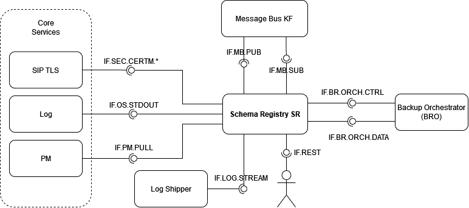
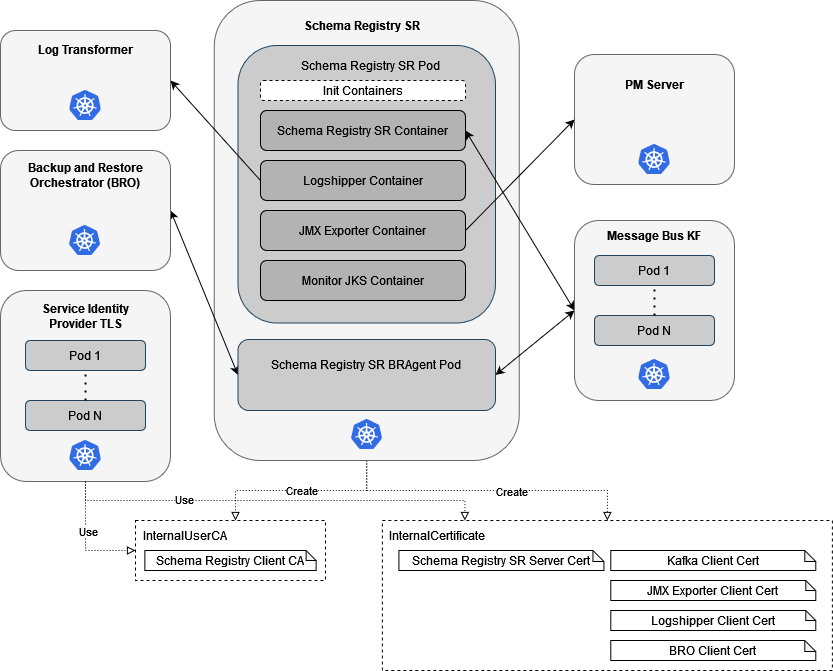
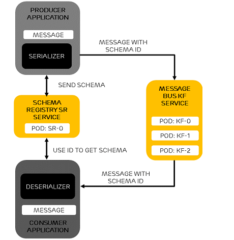

# Schema Registry SR User Guide

[TOC]

## Overview

This document provides an overview of the Schema Registry SR Service. It gives a
brief description of its main features and its interfaces.

The **Schema Registry SR** Service ensures that Apache Avro, JSON and Protobuf formatted messages sent between Producers and Consumers comply with schemas. It assigns an ID to each registered schema.

With this service, messages that Producers send include a referable schema ID instead of a complete schema.

On the Producer side, the flow is as follows:

1. The Producer uses a Serializer to produce message records for the **Message Bus KF** Service.
1. The Producer checks if the schema version is registered in the **Schema Registry SR** Service.
    - If the schema version is registered, or if it is an allowable evolution of a registered version, the Producer sends the message data to the **Message Bus KF** Service and includes a schema ID.
    - If no version of the schema is registered, the **Schema Registry SR** Service validates the version, then registers and caches it.
    - If the schema version is invalid, the **Schema Registry SR** Service throws an exception and the Serializer crashes the Producer.

On the Consumer side, the flow is as follows:

1. The Consumer receives the message data and the schema ID.
1. The Consumer deserializes the message. The Deserializer references a cached schema, if it exists. If no cached schema exists, it uses the schema ID to pull the schema from the **Schema Registry SR** Service.

Producers and Consumers can use different schema versions. In this case, the **Schema Registry SR** Service checks compatibility. If the schemas with different versions are compatible,
a schema evolution feature determines which schema is used. You can customize compatibility levels (BACKWARD, BACKWARD_TRANSITIVE, FORWARD, FORWARD_TRANSITIVE, FULL, FULL_TRANSITIVE, NONE).

### Supported Use Cases

IN PROGRESS

### Architecture

Producers and consumers perform lookups on the **Schema Registry SR** Service to check the validity and compatibility of Apache Avro, JSON and Protobuf messages that are sent and received through the **Message Bus KF** Service.

The following picture shows the **Schema Registry SR** Service and its
architectural context.



Figure 1 Architecture view of Schema Registry SR

#### Logical Interfaces

Interface Logical Name | Interface Realization | Description | Interface Maturity
---|---|---|---
 IF.REST | [Confluent Schema Registry API Documentation][SR-api-docs] | Interface that provides the possibility of communicating with the Schema Registry service via REST calls. | Stable
 IF.MB.PUB | [Message Bus KF Producer API](https://kafka.apache.org/25/javadoc/index.html?org/apache/kafka/clients/producer/KafkaProducer.html) | Interface of the *Message Bus KF* Service used to create topics, change the properties of the topics or to publish messages to the topics. | Stable
 IF.MB.SUB | [Message Bus KF Consumer API](https://kafka.apache.org/25/javadoc/org/apache/kafka/clients/consumer/KafkaConsumer.html) | Interface of the *Message Bus KF* Service used to subscribe to topics and to receive messages from those topics. | Stable
 IF.BR.ORCH.CTRL | [GRPC Specification](https://adp.ericsson.se/marketplace/backup-and-restore-orchestrator/documentation/development/additional-documents/grpc-api-specification) | Interface used for control and coordination messages / events between the *Backup And Restore Orchestrator (BRO)* and *Backup And Restore Agent*s. | Stable
 IF.BR.ORCH.DATA | [GRPC Specification](https://adp.ericsson.se/marketplace/backup-and-restore-orchestrator/documentation/development/additional-documents/grpc-api-specification) | Interface used for two-way data transfer between the *Backup And Restore Orchestrator (BRO)* and *Backup And Restore Agent*s during the Backup and Restore use cases. | Stable
 IF.LOG.STREAM | [Log Transformer Guide][LT-guide] | Interface used to stream logs directly to Log Transformer. | Stable
 IF.SEC.CERTM.* | [Service Identity Provider TLS API Documentation][SIP-api-docs] | Interface that provides the possibility to communicate with *Service Identity Provider TLS* Service. | Stable
 IF.OS.STDOUT | [Stdout-Redirect Application Guide](https://adp.ericsson.se/marketplace/log-shipper/documentation/development/additional-documents/stdout-redirect-application-developers-guide) | Interface used to stream logs to logfiles. | Stable
 IF.PM.PULL | [PM Server Guide][PM-guide] | A HTTP API used by *PM Server* to collect metric data from PM Providers. | Stable

#### Application Programming Interfaces (APIs)

For information about a well-defined REST API, provided by Confluent, that can be used with this service, see [Confluent Schema Registry API Documentation][SR-api-docs].

### Deployment View

The *Schema Registry SR* Service is packaged as a Docker container. It supports deployment in Kubernetes using Helm.

There are number of artifacts deployed by the system.
To begin, *Schema Registry SR* Service itself is deployed as two separate pods, and the pods also comprise multiple containers, see Figure 2.
There are custom resources (*InternalUserCA*, *InternalCertificate*) created as well to facilitate secure communication between interfaces.



Figure 2 Deployment view of Schema Registry SR

To deploy the Service, refer to the [Deployment section](#deployment), which:

- explains how to get started using the *Schema Registry SR* Service in the supported environments
- specifies configuration options for starting the *Schema Registry SR* docker container

If problems occur when using the service, refer to the [Troubleshooting section](#troubleshooting).

### Dimensioning and Characteristics

#### Dimensioning

To handle dimensioning configuration at deployment time,
refer to the [Service Dimensioning section](#service-dimensioning).

#### Scaling

*Schema Registry SR* does not support deployment of multiple instances, for scaling or any other purpose.

Scaling Supported (Yes/No) | Minimum number of instances | Maximum number of recommended instances
---|---|---
No                         | 1                           | 1

#### Resilience

*Schema Registry SR* does not support deployment of multiple instances, for scaling or any other purpose.

*Schema Registry SR* Service resilience is supported via

- Kubernetes probes towards the REST service endpoints to check its availability and responsiveness
- *Schema Registry SR* Service does not have any disk resident data, it uses *Message Bus KF* Service as a commit log to store all schemas durably. For data resiliency in *Message Bus KF* Service see [Message Bus KF Service Guide][KF-guide]
- optional usage of **Backup And Restore Agent**.

#### Upgrade - In Service Software Upgrade

*Schema Registry SR* does not support deployment of multiple instances, for scaling or any other purpose. During an upgrade the service is unavailable for a short period of time. Upgrade should be performed when there are no ongoing service activities in progress or planned for the near future.

## Deployment

The *Schema Registry SR* Service is packaged as a Docker container.
It supports deployment in Kubernetes using Helm.
The *Schema Registry SR* Service requires at least the prior deployment of the *Message Bus KF* Service.



### Prerequisites

- A running Kubernetes environment

- *Message Bus KF* deployment is running within the same namespace

- Some knowledge of the Kubernetes environment, including the networking details

- Access rights to deploy and manage workloads

- Availability of the `kubectl` CLI tool with correct authentication details. Contact the Kubernetes System Admin, if needed.

- Availability of Helm Charts and Docker images for the service and all dependent services

- For a secure deployment using TLS **Service Identity Provider TLS**, **Distributed Coordinator ED** and **Key Management** are required.
In this case **Service Identity Provider TLS** Custom Resource Definitions (CRD) also must be installed

- For sidecar logging **Log Shipper**, **Log Transformer** and **Search Engine** are required.

- For **Backup And Restore Agent** usage **Backup And Restore Orchestrator (BRO)** is required.

### Custom Resource Definition (CRD) Deployment

Custom Resource Definitions (CRD) are cluster-wide resources which must be
installed prior to the Schema Registry SR deployment.
The service that requires the latest CRD charts version set which CRD charts
version to use in the deployment.

> **Note:** The release name chosen for the CRD charts in the K8s deployment must be
kept and cannot be changed later.

Helm ALWAYS requires a namespace to deploy a chart and the namespace to be used
for the same per-service CRDs chart must be created before the CRDs charts are
loaded.

> **Note:** The upgrade of the CRDs must be done before deploying a service that
requires additional CRDs or a CRD version newer than the one already deployed on
the K8s cluster.
<br>

To deploy CRD do the following:

1. Add proj-adp-gs-all-helm as a Helm repository.

    ```
    helm repo add proj-adp-gs-all-helm https://arm.rnd.ki.sw.ericsson.se/artifactory/proj-adp-gs-all-helm
    ```

> **Note:** Helm charts for all the relevant services: [proj-adp-gs-all-helm][proj-adp-gs-all-helm]

1. Install the security related CRD services (internalcertificates, internalusercas).

    ```
    helm install eric-sec-sip-tls-crd proj-adp-gs-all-helm/eric-sec-sip-tls-crd \
      --wait
      --timeout 10m \
      --namespace <TEMPORARY_NAMESPACE> \ (1)
      --create-namespace
    ```

    The `<TEMPORARY_NAMESPACE>` will be deleted after the installation.<br /><br />

2. Verify CRD services (internalcertificates, internalusercas) installation was successful.

    ```
    kubectl api-resources \
      --api-group siptls.sec.ericsson.com \
      --output=name
    ```

    The above command should result in

    ```
    internalcertificates.siptls.sec.ericsson.com
    internalusercas.siptls.sec.ericsson.com
    ```

### Deployment in a Kubernetes Environment Using Helm

This section describes how to deploy the *Schema Registry SR* in Kubernetes using Helm and
the `kubectl` CLI client. Helm is a package manager for Kubernetes that
streamlines the installation and management of Kubernetes applications.

#### Preparation

Prepare helm chart and docker images. Helm chart in the following link
can be used for installation: [Schema Registry SR Chart][SR-charts]

#### Pre-Deployment Checks for Schema Registry SR Service

Ensure the following:

- The <RELEASE_NAME> is not used already in the corresponding cluster.
Use `helm list` command to list the existing deployments (and delete previous
deployment with the corresponding <RELEASE_NAME> if needed).

- The same namespace is used for all deployments.

#### Helm Chart Installations of Dependent Services

**Schema Registry SR** depends on **Message Bus KF**.
Make sure the *Message Bus KF* is deployed and healthy before you deploy the **Schema Registry SR** Service:

* **Message Bus KF** (See [Message Bus KF Service Guide][KF-guide])

For a secure deployment using TLS **Service Identity Provider TLS**, **Distributed Coordinator ED** and **Key Management** are required.
Make sure the following services are deployed and healthy for secure deployment using TLS:

* **Service Identity Provider TLS** (See [Service Identity Provider TLS Guide][SIP-guide])
* **Distributed Coordinator ED** (See [Distributed Coordinator ED Guide][DC-guide])
* **Key Management** (See [Key Management Guide][KM-guide])

For sidecar logging **Log Shipper**, **Log Transformer** and **Search Engine** are required.
Make sure the following services are deployed and healthy for sidecar logging:

* **Log Shipper** (See [Log Shipper Guide][LS-guide])
* **Log Transformer** (See [Log Transformer Guide][LT-guide])
* **Search Engine** (See [Search Engine Guide][SE-guide])

For **Backup And Restore Agent** usage **Backup And Restore Orchestrator (BRO)** is required.

* **Backup And Restore Orchestrator** (See [Backup and Restore Orchestrator Guide][BRO-guide])

#### Helm Chart Installation of Schema Registry SR Service

> **Note:** Ensure all dependent services are deployed and healthy before you continue with this step (see previous chapter).

Helm is a tool that streamlines installing and managing Kubernetes
applications. Schema Registry SR can be deployed on Kubernetes using
Helm Charts. Charts are packages of pre-configured Kubernetes resources.

Users can override the default values provided in the values.yaml template of
the helm chart. The recommended parameters to override are listed in the
following section: [Configuration Parameters](#configuration-parameters).

##### Deploy the Schema Registry SR Service

Install the *Schema Registry SR* on the Kubernetes cluster by using the helm installation command:

```
helm install <RELEASE_NAME> \ (1)
  <CHART_REFERENCE> \ (2)
  --namespace <NAMESPACE> \(3)
```

(1): String value, a name to identify and manage your helm chart.<br>
(2): A path to a packaged chart, a path to an unpacked chart directory or a URL.<br>
(3): String value, a name to be used dedicated by the user for deploying own helm charts.<br>

<li><b>NOTE: </b>Schema Registry supports Service Mesh if it is enabled</li>
<li>If inside service mesh to outside service mesh(ism2osm) and tls needs to be enabled then following configuration can be added in values.yaml.
Example of it has been added here
values.yaml</li>
<code><pre>
messaging:
&ensp;&ensp;kafka:
&ensp;&ensp;&ensp;&ensp;issuerReference: eric-data-message-bus-kf-client-client-ca
&ensp;&ensp;&ensp;&ensp;bootstrapServersTls: eric-data-message-bus-kf-client:9093
&ensp;&ensp;&ensp;&ensp;bootstrapServers: eric-data-message-bus-kf-client:9092
</code></pre>
<li><b>NOTE : </b>Internalcertificate resource is used to create a secret with the application certificates for an ism2osm connection.The main requirement is that the microservices inside the mesh has to disable any native TLS management. In a connection ism2osm the certificates natively mounted inside the microservices have to be mounted in the istio-proxy.
The destination rule will configure istio-proxy to use the mounted certificates in order to reach the destination target</li>

##### Verify the Schema Registry SR Service Availability

To verify whether the deployment is successful, do as follows:

1.  Check if the chart is installed with the provided release name and
    in related namespace by using the following command:

```
helm ls --namespace eric-oss-schema-registry-sr-install --output yaml
```

> **Note:** `--output` flag set to *yaml* only for the output brevity.

_Expected result_

```
- app_version: ""
  chart: eric-oss-schema-registry-sr-1.1.6+49 (1)
  name: eric-oss-schema-registry-sr
  namespace: eric-oss-schema-registry-sr-install
  revision: "1"
  status: deployed (2)
  updated: 2021-08-30 14:59:46.1242969 +0200 CEST (3)
```

(1) Exact version can differ from this example. <br/>
(2) Chart status should be reported as "deployed".<br/>
(3) Exact time can differ from this example.

2.  Verify the status of the deployed helm chart.

```
helm status <release_name>
```

  Chart status should be reported as "deployed". <br/>
  All Pods status should be reported as "Running" and number of Deployment Available should be the
  same as the replica count.

3.  Verify that the pods are running by getting the status for your pods.

```
kubectl get pods --namespace=<namespace> -L role
```

  For example:

```
helm ls example
helm status examplerelease
kubectl get pods --namespace=example -L role
```

  All pods status should be "Running".<br/>
  All containers in any pod should be reported as "Ready". <br/>
  There is one POD marked as the master role and the other PODs are marked as the replica role.

##### Additional Verification of the Availability of the Schema Registry SR Service

The **Schema Registry SR** Service should now be deployed. To verify that the service is functional, do the following:

1. Use the following `kubectl exec` command to open Schema Registry command prompt.

```
winpty kubectl exec \ (1)
  <SCHEMA_REGISTRY_POD_NAME> \ (2)
  --container <SCHEMA_REGISTRY_CONTAINER_NAME> \ (3)
  --stdin \
  --tty \
  --namespace <SCHEMA_REGISTRY_NAMESPACE> \ (4)
  "--" sh -c "(bash || ash || sh)"
```

(1) For Windows GitBash users use the `winpty` to allow TTY.<br/>
(2) The name of the *Schema Registry SR* Pod in the running Kubernetes environment.<br/>
(3) The name of the Schema Registry container running in the *Schema Registry SR* Pod.<br/>
(4) The name of the namespace in which *Schema Registry SR* is deployed.<br/>

From the opened command prompt execute the following commands to verify *Schema Registry SR* Service is working correctly.

1. Identify which subjects are running in the *Schema Registry SR* Service.

```
curl --request GET http://<SCHEMA_REGISTRY_HOST>:<SCHEMA_REGISTRY_PORT>/subjects
[] (1)
```

(1) The correct output is an empty list *[]* because no subjects should be created for the *Schema Registry SR* Service yet.<br/>

2. Register a new schema with the name of *sr_test_schema* in *Schema Registry SR* Service.

```
curl --request POST \
  --header "Content-Type: application/vnd.schemaregistry.v1+json" \
  --header "Accept: application/json" \
  --data '<SCHEMA_TO_REGISTER>' \
  http://<SCHEMA_REGISTRY_HOST>:<SCHEMA_REGISTRY_PORT>/subjects/sr_test_schema/versions (1)
{"id":1} (2)
```

(1) The endpoint to register a schema is: http://<SCHEMA_REGISTRY_HOST>:<PORT>/subjects/{SCHEMA_NAME}/versions_<br/>
(2) The output indicates **Schema Registry SR** Service successfully registered **sr_test_schema** subject with the id of 1.<br/>

3. Identify which subjects are running in the **Schema Registry SR** Service.

```
curl --request GET http://<SCHEMA_REGISTRY_HOST>:<SCHEMA_REGISTRY_PORT>/subjects
["sr_test_schema"] (1)
```

(1) The output indicates **sr_test_schema** is a registered subject.

4. Fetch a schema with a given id.

```
curl --request GET http://<SCHEMA_REGISTRY_HOST>:<SCHEMA_REGISTRY_PORT>/schemas/ids/1 (1)
{"schema":"\"string\""}
```

(1) The endpoint to fetch schema by id is: http://<SCHEMA_REGISTRY_HOST>:<SCHEMA_REGISTRY_PORT>/schemas/ids/{ID}

### Configuration Parameters

#### Mandatory Configuration Parameters

**Schema Registry SR** has no mandatory parameters.

#### Optional Configuration Parameters

Following parameters are not mandatory. The *Schema Registry SR* Service uses a configuration interface based on environment variables that are defined in the Helm Chart. You can set these variables during the deployment of the Helm Chart (using the --set argument).
If no variables are set, the default values provided in the Helm Chart are used.

| Variable Name | Description | Default Value |
|---|---|---|
| `global.annotations` | Global annotations to be propagated to manifest objects. Expressed as key/value pair(s). | `{}`
| `global.internalIPFamily` | Global ip families for dual-stack implementation. Possible values are: `IPv4`, `IPv6` | `[]`
| `global.labels` | Global labels to be propagated to manifest objects. Expressed as key/value pair(s). | `{}`
| `global.nodeSelector` | Global setting for nodeSelector. nodeSelector is a map of key-value pairs to schedule pods on labeled nodes. | `{}`
| `global.pullSecret` | Sets the global level image registry secret. Conditional, will not be considered when `imageCredentials.pullSecret` is set. |
| `global.registry.imagePullPolicy` | The default imagePullPolicy to use. Can be granularized using the specific `imageCredentials.<service>.registry.imagePullPolicy` parameters. | `IfNotPresent`
| `global.registry.url` | Global image registry url. | `armdocker.rnd.ericsson.se`
| `global.security.policyBinding.create` | Create Policy RoleBinding. | `false`
| `global.security.policyReferenceMap.default-restricted-security-policy` | Set cluster role reference to security policy. | `default-restricted-security-policy`
| `global.security.tls.enabled` | Enable/Disable TLS on all *Schema Registry SR* interfaces. | `true`
| `global.timezone` | Sets the container timezone. Possible time zone values are [IANA Time Zone Database][Iana]. | `UTC`
| `global.fsGroup.manual` | The fsGroup creates a new group, assigns the service as part of the group, sets the new group as the owner of the shared data, and finally sets read/write group access to the data. | `10000`
| `global.fsGroup.namespace` | The namespace default fsGroup can be used. | `""`
| `global.podSecurityContext.supplementalGroups` | Sets the GID value(s) for volume data that is used by the services (Note. The values are ammended to the local values). | `null`
| `annotations` | List of key/value pairs of annotations appended to every created resource object | `{}`
| `affinity.podAntiAffinity` | Anti-affinity rules configuration must be introduced so pods can be scheduled across the worker nodes in the cluster to withstand the worker node failures. Valid values are "soft" or "hard". | `"soft"`
| `imageCredentials.pullSecret` | Sets the service level image registry secret. Overrides `global.pullSecret`. |
| `imageCredentials.schemaregistry.registry.imagePullPolicy` | The imagePullPolicy for *Schema Registry SR* image. Overrides `global.registry.imagePullPolicy`. |
| `imageCredentials.schemaregistry.registry.url` | The Docker registry url for *Schema Registry SR*. Overrides `global.registry.url`. |
| `imageCredentials.schemaregistry.repoPath` | The Docker repository path for *Schema Registry SR*. |
| `imagePullPolicy` | **DEPRECATED**, use `global.registry.imagePullPolicy` The image pull policy for *Schema Registry SR*. | `IfNotPresent`
| `ingress.caCertificateSecret` | Name of secret that contain ingress CA that would be added to truststore |
| `java.opts` | A string of extra JVM options to pass to the *Schema Registry SR*. |
| `kafkastoreTopic` | The *Message Bus KF* topic where *Schema Registry SR* stores its schemas. | `"_schemas"`
| `labels` | Additional labels allow a list of key/values to be appended to the list of labels of the resource object. | `{}`
| `log.schemaregistry.level` | The root log level for *Schema Registry SR*. | `"info"`
| `nodeSelector.schemaregistry` | A map of key-value pairs to schedule pods on labeled nodes. | `{}`
| `podDisruptionBudget.maxUnavailable` | The maximum unavailable Pods that can be evicted during administration activities. For further reference visit the [Kubernetes PodDisruptionBudget][Kub-pod-dist-bud]. | `1`
| `podPriority.priorityClassName` | Sets the priority class for *Schema Registry SR* pods. Priority indicates the importance of a Pod relative to other Pods. |
| `probes.general.livenessProbe.initialDelaySeconds` | The number of seconds that kubelet waits before performing the first health check probe for: **Backup and Restore Agent** **Schema Registry SR** **JMX Exporter** | `60`
| `probes.general.livenessProbe.failureThreshold` | Minimum consecutive failures for the probe to be considered failed after having succeeded. Defaults to 3. Minimum value is 1. Applies for: **Backup and Restore Agent** **Schema Registry SR** **JMX Exporter** | `3`
| `probes.general.livenessProbe.periodSeconds` | How often (in seconds) to perform the probe. Default to 10 seconds. Minimum value is 1. Applies for: **Backup and Restore Agent** **Schema Registry SR** **JMX Exporter** | `10`
| `probes.general.livenessProbe.timeoutSeconds` | The number of seconds to allow before the liveness probe times out for: **Backup and Restore Agent** **Schema Registry SR** **JMX Exporter** | `5`
| `probes.general.readinessProbe.initialDelaySeconds` | The number of seconds that kubelet waits before performing the first health check probe for: **Backup and Restore Agent** **Schema Registry SR** **JMX Exporter** | `60`
| `probes.general.readinessProbe.failureThreshold` | Minimum consecutive failures for the probe to be considered failed after having succeeded. Defaults to 3. Minimum value is 1. Applies for: **Backup and Restore Agent** **Schema Registry SR** **JMX Exporter** | `3`
| `probes.general.readinessProbe.periodSeconds` | How often (in seconds) to perform the probe. Default to 10 seconds. Minimum value is 1. Applies for: **Backup and Restore Agent** **Schema Registry SR** **JMX Exporter** | `5`
| `probes.general.readinessProbe.successThreshold` | Minimum consecutive successes for the probe to be considered successful after having failed. Defaults to 1. Must be 1 for liveness and startup. Minimum value is 1. Applies for: **Backup and Restore Agent** **Schema Registry SR** **JMX Exporter** | `1`
| `probes.general.readinessProbe.timeoutSeconds` | The number of seconds to allow before the readiness probe times out for: **Backup and Restore Agent** **Schema Registry SR** **JMX Exporter** | `5`
| `probes.monitorjks.livenessProbe.initialDelaySeconds` | The number of seconds that kubelet waits before performing the first health check probe for *eric-oss-schema-registry-sr-monitor-jks* container. | `60`
| `probes.monitorjks.livenessProbe.failureThreshold` | The number of failures before considering the liveness probe to have failed for *eric-oss-schema-registry-sr-monitor-jks* container. | `3`
| `probes.monitorjks.livenessProbe.periodSeconds` | The kubelet should perform a liveness probe for the set interval for *eric-oss-schema-registry-sr-monitor-jks* container. | `10`
| `probes.monitorjks.livenessProbe.timeoutSeconds` | The number of seconds before considering the readiness probe to have failed for *eric-oss-schema-registry-sr-monitor-jks* container. | `10`
| `probes.monitorjks.readinessProbe.initialDelaySeconds` | The number of seconds that kubelet waits before performing the first readiness check for *eric-oss-schema-registry-sr-monitor-jks* container. | `10`
| `probes.monitorjks.readinessProbe.failureThreshold` | The number of failures before considering the readiness probe to have failed for *eric-oss-schema-registry-sr-monitor-jks* container. | `3`
| `probes.monitorjks.readinessProbe.periodSeconds` | The kubelet should perform a readiness probe for the set interval for *eric-oss-schema-registry-sr-monitor-jks* container. | `5`
| `probes.monitorjks.readinessProbe.successThreshold` | The number of success before considering the readiness probe successful for *eric-oss-schema-registry-sr-monitor-jks* container. | `1`
| `probes.monitorjks.readinessProbe.timeoutSeconds` | The number of seconds before considering the readiness probe to have failed for *eric-oss-schema-registry-sr-monitor-jks* container. | `5`
| `productInfo.rstate` | The product info for RSTATE for *Schema Registry SR*. | The product info RSTATE generated at release.
| `replicas` | The number of *Schema Registry SR* instances. | `1`
| `resources.schemaregistry.limits.cpu` | The maximum CPU that can be requested by *Schema Registry SR*. | `"1"`
| `resources.schemaregistry.limits.memory` | The maximum memory that can be requested by *Schema Registry SR*. | `"1Gi"`
| `resources.schemaregistry.requests.cpu` | The minimum CPU required at startup by *Schema Registry SR*. | `"100m"`
| `resources.schemaregistry.requests.memory` | The minimum memory required at startup by *Schema Registry SR*. | `"128Mi"`
| `security.tls.schemaregistry.port` | The TLS port to use for *Schema Registry SR*. | `"8082"`
| `security.plaintext.schemaregistry.port` | The PLAINTEXT port to use for *Schema Registry SR*. | `"8081"`
| `service.type` | The service type of *Schema Registry SR*. | `ClusterIP`
| `service.endpoints.schemaregistry.tls.enforced` | Enforce tls only communication between *Schema Registry SR* and its clients. Values supported: `optional`, `required` | `"required"`
| `service.endpoints.schemaregistry.tls.verifyClientCertificate` | Enable client cert authentication (mTLS). Values supported: `optional`, `required` | `"required"`
| `service.endpoints.schemaregistry.tls.certTtl` | *Schema Registry SR* server certificate time to live in sec. See [Service Identity Provider TLS API Documentation][SIP-api-docs] | `604800`
| `service.endpoints.schemaregistry.tls.certLeadTime` | *Schema Registry SR* server certificate renewal lead time in sec. See [Service Identity Provider TLS API Documentation][SIP-api-docs] | `4800`
| `tolerations` | Tolerations set for *Schema Registry SR*. | `[]`
| `terminationGracePeriodSeconds` | Graceful time for *Schema Registry SR*. | `30 sec`
| `topologySpreadConstraints` | Used to control how Pods are spread across your cluster among failure-domains. | `{}`
| `updateStrategy.type` | The update strategy for *Schema Registry SR*. | `"RollingUpdate"`

Note: "MaxRAMPercentage=80.0" can be used for java.opts to utilize 80% of the memory limit.

##### Backup and Restore Agent configuration parameters

The *Backup and Restore Agent* uses a configuration interface based on environment variables that are defined in the Helm Chart.
You can set these variables during the deployment of the Helm Chart (using the --set argument).
If no variables are set, the default values provided in the Helm Chart are used.

| Variable Name | Description | Default Value |
|---|---|---|
| `brAgent.enabled` | Switch to enable/disable the *Backup and Restore Agent*. | `false`
| `brAgent.replicaCount` | The number of *Backup and Restore Agent* instances deployed. | `1`
| `brAgent.logLevel` | The log level for *Backup and Restore Agent*. | `"INFO"`
| `brAgent.backupTypeList` | The list of backup types (scope) that the *Backup and Restore Agent* participates in. |
| `brAgent.properties.fileName` | The application file name used by *Backup and Restore Agent*. | `"application.properties"`
| `brAgent.logging.fileName` | The log file name used by *Backup and Restore Agent*. | `"log4j2.xml"`
| `brAgent.logging.log4jxml` | The `brAgent.logging.fileName` configuration content. | [Backup and Restore Agent Log configfile content](#backup-and-restore-agent-log-configfile-content)
| `brAgent.grpc.backup.dataChannelTimeoutSecs` | The time, in seconds, to wait for the data channel to be ready before aborting the backup. | `30`
| `brAgent.grpc.backup.fragmentChunkSize` | The maximum size, in KiB, of fragment chunk to send with each backup data message. | `512`
| `imageCredentials.bragent.registry.imagePullPolicy` | The imagePullPolicy for *Backup and Restore Agent* image. Overrides `global.registry.imagePullPolicy`. |
| `imageCredentials.bragent.registry.url` | The Docker registry url for *Backup and Restore Agent*. Overrides `global.registry.url`. |
| `imageCredentials.bragent.repoPath` | The Docker repoPath of the *Backup and Restore Agent*. |
| `nodeSelector.brAgent` | A map of key-value pairs to schedule pods on labeled nodes. | `{}`
| `resources.brAgent.limits.cpu` | The maximum CPU that can be requested by *Backup and Restore Agent*. | `"1"`
| `resources.brAgent.limits.memory` | The maximum memory that can be requested by *Backup and Restore Agent*. | `"1Gi"`
| `resources.brAgent.requests.cpu` | The minimum CPU required at startup by *Backup and Restore Agent*. | `"100m"`
| `resources.brAgent.requests.memory` | The minimum memory required at startup by *Backup and Restore Agent*. | `"128Mi"`
| `service.endpoints.bragent.tls.enforced` | **IN PROGRESS** Enforce tls only communication between *Backup and Restore Agent* and *Backup and Restore Orchestrator (BRO)*. Values supported: `optional`, `required` | `"required"`
| `service.endpoints.bragent.tls.certTtl` | **IN PROGRESS** *Backup and Restore Agent* client certificate time to live in sec. See [Service Identity Provider TLS API Documentation][SIP-api-docs] | `604800`
| `service.endpoints.bragent.tls.certLeadTime` | **IN PROGRESS** *Backup and Restore Agent* client certificate renewal lead time in sec. See [Service Identity Provider TLS API Documentation][SIP-api-docs] | `4800`


###### *Backup and Restore Agent* Log Configfile content

```xml
<Configuration status="WARN" monitorInterval="30" packages="com.ericsson.adp.mgmt.sr.bragent.logging">
    <Appenders>
        <Console name="Appender" target="SYSTEM_OUT" follow="true">
            <AdpJsonLayout compact="true" eventEol="true" >
               <!--  Mandatory Fields -->
               <KeyValuePair key="version" value="0.3.0"/>
               <KeyValuePair key="timestamp" value="yyyy-MM-dd'T'HH:mm:ss.SSSZ"/>
               <KeyValuePair key="service_id" value="eric-oss-schema-registry-sr-bragent"/>
               <RewriteField oldKey="level_standardLevel" newKey="severity"/>
               <RewriteField oldKey="message_formattedMessage" newKey="message"/>
               <!--  Optional Fields -->
               <KeyValuePair key="function" value="Backup and Restore"/>
               <KeyValuePair key="category" value="Schema Registry SR"/>
               <RewriteField oldKey="source_classLoaderName" newKey="proc_id"/>
               <RewriteField oldKey="source_className" newKey="ul_id"/>
            </AdpJsonLayout>
        </Console>
    </Appenders>
    <Loggers>
        <Root level="${env:LOG_LEVEL:-INFO}">
            <AppenderRef ref="Appender" />
        </Root>
    </Loggers>
</Configuration>
```

*NOTE:* For more specific information on the *Backup and Restore Agent* configuration see [Backup and Restore Orchestrator Guide][BRO-guide].

##### Message Bus KF configuration parameters

The *Message Bus KF* uses a configuration interface based on environment variables that are defined in the Helm Chart.
You can set these variables during the deployment of the Helm Chart (using the --set argument).
If no variables are set, the default values provided in the Helm Chart are used.

| Variable Name | Description | Default Value |
|---|---|---|
| `messagebuskf.clientServiceName` | The *Message Bus KF* Bootstrap Server host name. See [Message Bus KF Developers Guide][KF-dev-guide] | `eric-data-message-bus-kf-client`
| `messagebuskf.issuerReference` | The certificate issuer reference name. See [Message Bus KF Developers Guide][KF-dev-guide] | `eric-data-message-bus-kf-client-client-ca`
| `messagebuskf.clientPort` | The PLAINTEXT port for *Message Bus KF* Bootstrap Server. | `9092`
| `messagebuskf.secureClientPort` | The TLS port for *Message Bus KF* Bootstrap Server. | `9093`
| `messagebuskf.clientTimeout` | The time, in miliseconds, for *Schema Registry SR*  will wait for *Message Bus KF* to be ready. | `30000`
| `messagebuskf.minBrokers` | The minimum number of *Message Bus KF* brokers *Schema Registry SR* will wait for. Should be equal to the running instances of *Message Bus KF* in the Kubernetes environment. Setting the value to `-1` disables kafka initialization checks. | `3`
| `service.endpoints.messagebuskf.tls.enforced` | Enforce tls only communication between *Message Bus KF* and *Schema Registry SR*. Values supported: `optional`, `required` | `"required"`
| `service.endpoints.messagebuskf.tls.certTtl` | *Message Bus KF* client certificate time to live in sec. See [Service Identity Provider TLS API Documentation][SIP-api-docs] | `604800`
| `service.endpoints.messagebuskf.tls.certLeadTime` | *Message Bus KF* client certificate renewal lead time in sec. See [Service Identity Provider TLS API Documentation][SIP-api-docs] | `4800`
| `messagebuskf.srclientcn` | Flag to update kafkastore timeoutms, when it set as sr then default value 500ms override to 5000ms | kf  
*NOTE:* For more specific information on the *Message Bus KF* configuration [Message Bus KF Service Guide][KF-guide].

##### JMX Exporter configuration parameters

| Variable Name | Description | Default Value |
|---|---|---|
| `imageCredentials.jmxexporter.registry.imagePullPolicy` | The imagePullPolicy for *JMX Exporter* image. Overrides `global.registry.imagePullPolicy`. |
| `imageCredentials.jmxexporter.registry.url` | The Docker registry url for *JMX Exporter*. Overrides `global.registry.url`. |
| `imageCredentials.jmxexporter.repoPath` | The Docker repository path for *JMX Exporter*. |
| `jmx.enabled` | Switch to enable/disable the *JMX Exporter*. | `true`
| `jmx.hostName` | The Remote Method Invocation (RMI) hostname. | `127.0.0.1`
| `jmx.destPort` | The *Schema Registry SR* JMX port that *JMX Exporter* connects to. | `10000`
| `jmx.servicePort` | The *JMX Exporter* port to receive HTTP requests. | `21000`
| `probes.jmx.livenessProbe.initialDelaySeconds` | The number of seconds that kubelet waits before performing the first health check probe for *eric-oss-schema-registry-sr-jmx* container. | `10`
| `probes.jmx.livenessProbe.failureThreshold` | The number of failures before considering the liveness probe to have failed for *eric-oss-schema-registry-sr-jmx* container. | `3`
| `probes.jmx.livenessProbe.periodSeconds` | The kubelet should perform a liveness probe for the set interval for *eric-oss-schema-registry-sr-jmx* container. | `60`
| `probes.jmx.livenessProbe.timeoutSeconds` | The number of seconds before considering the readiness probe to have failed for *eric-oss-schema-registry-sr-jmx* container. | `60`
| `probes.jmx.readinessProbe.initialDelaySeconds` | The number of seconds that kubelet waits before performing the first readiness check for *eric-oss-schema-registry-sr-jmx* container. | `10`
| `probes.jmx.readinessProbe.failureThreshold` | The number of failures before considering the readiness probe to have failed for *eric-oss-schema-registry-sr-jmx* container. | `3`
| `probes.jmx.readinessProbe.periodSeconds` | The kubelet should perform a readiness probe for the set interval for *eric-oss-schema-registry-sr-jmx* container. | `60`
| `probes.jmx.readinessProbe.successThreshold` | The number of success before considering the readiness probe successful for *eric-oss-schema-registry-sr-jmx* container. | `1`
| `probes.jmx.readinessProbe.timeoutSeconds` | The number of seconds before considering the readiness probe to have failed for *eric-oss-schema-registry-sr-jmx* container. | `60`
| `resources.jmx.limits.cpu` | The maximum CPU that can be requested by *JMX Exporter*. | `"200m"`
| `resources.jmx.limits.memory` | The maximum memory that can be requested by *JMX Exporter*. | `"512Mi"`
| `resources.jmx.requests.cpu` | The minimum CPU required at startup by *JMX Exporter*. | `"100m"`
| `resources.jmx.requests.memory` | The minimum memory required at startup by *JMX Exporter*. | `"128Mi"`
| `service.endpoints.jmx.tls.enforced` | Enforce tls only communication between *JMX Exporter* and *Schema Registry SR*. Values supported: `optional`, `required` | `"optional"`
| `service.endpoints.jmx.tls.verifyClientCertificate` | Enable client cert authentication (mTLS) between *JMX Exporter* and *Schema Registry SR*. Values supported: `optional`, `required` | `"required"`
| `service.endpoints.jmx.tls.certTtl` | *JMX Exporter* client certificate time to live in sec. See [Service Identity Provider TLS API Documentation][SIP-api-docs] | `604800`
| `service.endpoints.jmx.tls.certLeadTime` | *JMX Exporter* client certificate renewal lead time in sec. See [Service Identity Provider TLS API Documentation][SIP-api-docs] | `4800`

##### Log Shipper configuration parameters

The *Log Shipper* uses a configuration interface based on environment variables that are defined in the Helm Chart.
You can set these variables during the deployment of the Helm Chart (using the --set argument).
If no variables are set, the default values provided in the Helm Chart are used.

| Variable Name | Description | Default Value |
|---|---|---|
| `imageCredentials.logshipper.registry.imagePullPolicy` | The imagePullPolicy for *Log Shipper* image. Overrides `global.registry.imagePullPolicy`. |
| `imageCredentials.logshipper.registry.url` | The Docker registry url for *Log Shipper*. Overrides `global.registry.url`. |
| `imageCredentials.logshipper.repoPath` | The Docker repository path for *Log Shipper*. | `proj-adp-log-released`
| `probes.logshipper.livenessProbe.initialDelaySeconds` | The number of seconds that kubelet waits before performing the first health check probe for *Log Shipper*. | `1`
| `probes.logshipper.livenessProbe.failureThreshold` | The number of failures before considering the liveness probe to have failed for *Log Shipper*. | `3`
| `probes.logshipper.livenessProbe.periodSeconds` | The kubelet should perform a liveness probe for the set interval for *Log Shipper*. | `10`
| `probes.logshipper.livenessProbe.timeoutSeconds` | The number of seconds to allow before the liveness probe times out for *Log Shipper*. | `10`
| `log.outputs` | The output for the *Log Shipper*. Values supported: *"stdout"*  *"stream"* | `[ "stdout" ]`
| `log.logshipper.level` | The logging level of the *Log Shipper*. Values supported: *debug* *info* *warning* *error* | `"info"`
| `logShipper.disableProbes` | Probes always return true during startup phase to break deployment dependency | `true`
| `logShipper.logplane` | The log plane to be used by *Log Shipper*. | `adp-app-logs`
| `logShipper.runAndExit` | When true *Log Shipper* sidecar will exit automatically after the main container has completed. This setting is intended to be used when deployed in pods that run and exit such as cronjobs. | `false`
| `logShipper.shutdownDelay` | Shutdown delay in number of seconds. Time will be applied after the shutdown signal received from Kubernetes and if pid files are present after all those processes have stopped. | `10`
| `logShipper.storage.path` | Share volume name where logs are written. | `/logs`
| `logShipper.storage.size` | Storage limit. | `15Mi`
| `logShipper.storageAllocation` | Storage limit for shared volume. | `1Gi`
| `logShipper.storageMedium` | By default, emptyDir volumes will be selected from the node filesystem such as disk, SSD or network storage which is the default filesystem in the cluster environment. To setup tmpfs (RAM-backed filesystem), set the value to Memory. |
| `logShipper.harvester.closeTimeout` | The predefined duration *Log Shipper* will have file handlers open. | `"5m"`
| `logShipper.logtransformer.host` | The Kubernetes service name for accessing the Logstash host. This is used as an IP address and must be the same as the name given to the Logstash service in that Helm chart. | `eric-log-transformer`
| `resources.logshipper.limits.cpu` | The maximum CPU that can be requested by *Log shipper*. | `"250m"`
| `resources.logshipper.limits.memory` | The maximum memory that can be requested by *Log Shipper*. | `"500Mi"`
| `resources.logshipper.requests.cpu` | The minimum CPU required at startup by *Log Shipper*. | `"100m"`
| `resources.logshipper.requests.memory` | The minimum memory required at startup by *Log Shipper*. | `"100Mi"`

*NOTE:* For more specific information on the *Log Shipper* configuration [Log Shipper Deployment Guide][LS-guide]


### Service Dimensioning

The service provides by default resource request values and resource limit
values as part of the Helm chart. These values correspond to a default size for
deployment of an instance. This chapter gives guidance in how to do service
dimensioning and how to change the default values when needed.

|MicroservicesMemory | RequestedMemory Limit | CPU requested | CPU limit
|--------------------|-----------------------|---------------|----------
|Schema Registry     |128Mi | 100m |1Gi| 1

Currently Identified characteristics:

max 900 number of schema registered in schema registry
5 number of schema registered in schema registry per second
60 number of schema retrieved from schema registry per second

Maximum load of the schema is 8KB(file size)

#### Override Default Dimensioning Configuration

If other values than the default resource request and default resource limit
values are preferred, they must be overridden at deployment time.

Here is an example of the `helm install` command where resource requests and
resource limits are set:

```
helm install eric-oss-schema-registry-sr https://arm.seli.gic.ericsson.se/artifactory/proj-eric-oss-drop-helm/eric-oss-schema-registry-sr/eric-oss-schema-registry-sr-1.56.0-1.tgz \ 
  --namespace eric-oss-schema-registry-sr-install \
  --set resources.schemaregistry.limits.cpu=2 \
  --set resources.schemaregistry.limits.memory=2Gi
```

#### Use Maximum (Default) Configuration per Service Instance

The maximum recommended configuration per instance is provided as default in the
Helm chart. Both Resource Request values and Resource Limit values are included
in the helm charts.

### Hardening

The service is by default pre-hardened. No additional hardening is required.
The following pre-hardening actions have been made:

* The service is built on a minimalistic container image with small footprint. Only the required libraries are included.

* The service utilizes a container optimized operating system (SUSE Linux Enterprise Server) and latest security patches are applied.

* The container goes through vulnerability scanning.

* The service is configured to the strict minimum of services and ports to minimize the attack surface.

### Upgrade Procedures

#### Upgrade Preparation

1. Download the Helm chart of the new release.

For the detailed information about how to get a new Helm chart, see [Preparation](#preparation).

2. Verify the deployment using steps in [Verify Schema Registry SR Service Availability](#verify-schema-registr-sr-service-availability).

#### Upgrade Procedure

>**_Note:_** If any chart value is customized at upgrade time through the
>"--set" option of the "helm upgrade" command, all other previously customized
>values will be replaced with the ones included in the new version of the chart.
>To make sure that any customized values are carried forward as part of the
>upgrade, consider keeping a versioned list of such values. That list could be
>provided as input to the upgrade command in order to be able to use the "--set"
>option without side effects.

#### Upgrade Schema Registry SR from previous version

1. To upgrade the *Schema Registry SR* Service after a new version becomes available, run the `helm upgrade` command using the following syntax:

```
helm upgrade <RELEASE_NAME> \ (1)
  <CHART_REFERENCE> \ (2)
  --namespace <NAMESPACE> \(3)
```

(1): String value, a name to identify and manage your helm chart.<br />
(2): A path to a packaged chart, a path to an unpacked chart directory or a URL.<br />
(3): String value, a name to be used dedicated by the user for deploying own helm charts.<br />

#### Roll Back Schema Registry SR to previous version
1. Get historical revisions of the release.

```
helm history <RELEASE_NAME> \ (1)
  <CHART_REFERENCE> \ (2)
  --namespace <NAMESPACE> \(3)
```

(1): String value, a name to identify and manage your helm chart.<br />
(2): A path to a packaged chart, a path to an unpacked chart directory or a URL.<br />
(3): String value, a name to be used dedicated by the user for deploying own helm charts.<br />

_Expected result_

```
- app_version: ""
  chart: eric-oss-schema-registry-sr-1.1.6+49 (1)
  description: Install complete
  revision: 1
  status: superseded
  updated: "<DATE>"
- app_version: ""
  chart: eric-oss-schema-registry-sr-1.1.5+3 (1)
  description: Upgrade complete
  revision: 2
  status: deployed
  updated: "2021-09-03T09:42:16.4399513+02:00" (2)
```

(1) Exact versions can differ from this example. <br/>
(2) Exact time can differ from this example.

1. To roll back The *Schema Registry SR* Service to a previous version select the revision number and run the `helm rollback` command using the following syntax:

```
helm rollback <RELEASE_NAME> \ (1)
  <ROLLBACK_REVISION> \ (2)
  <CHART_REFERENCE> \ (3)
  --namespace <NAMESPACE> \ (4)
```

(1): String value, a name to identify and manage your helm chart.<br />
(2): The roll back revision version.<br />
(3): A path to a packaged chart, a path to an unpacked chart directory or a URL.<br />
(4): String value, a name to be used dedicated by the user for deploying own helm charts.<br />

#### Upgrade from PLAINTEXT to secure TLS deployment

*NOTE:* Before performing the below tasks dependencies must be upgraded. <br />
For details please check [Helm Chart Installations of Dependent Services](#helm-chart-installations-of-dependent-services)

1. Run the `helm upgrade` command using the following syntax:

```
helm upgrade <RELEASE_NAME> \ (1)
  <CHART_REFERENCE> \ (2)
  --namespace <NAMESPACE> \(3)
  --reuse-values
  --set global.security.tls.enabled=true
```

(1): String value, a name to identify and manage your helm chart.<br />
(2): A path to a packaged chart, a path to an unpacked chart directory or a URL.<br />
(3): String value, a name to be used dedicated by the user for deploying own helm charts.<br />

## Security Guidelines

### Operative Tasks

This service does not include any operative tasks.

### External Ports

No ports are exposed to the outside of the cluster.

### Internal Ports

The following ports are cluster internal ports and not exposed to the outside:

|Service or Interface name | Protocol | IP Address Type | Port | Transport Protocol | IP Version |
|---|---|---|---|---|---|
|Schema Registry Plaintext Port|HTTP|Hostname|8081|TCP|IPv4 and IPv6
|Schema Registry TLS Port|HTTPS|Hostname|8082|TCP|IPv4 and IPv6
|JMX Exporter TLS Port|HTTPS|Hostname|21000|TCP|IPv4 and IPv6
|JMX Exporter Plaintext Port|HTTP|Hostname|21000|TCP|IPv4 and IPv6

### Certificates

Service uses certificates for System-Internal TLS-Based Communication. No other certificates are used.

### Security Events That Can Be Logged

No security events are logged by the service.

## Privacy User Guidelines

The service does not collect, store or process personal data on its own, PTI==0

## Operation and Maintenance

### Performance Management

#### KPIs

Refer to the [*Schema Registry* documentation][SR-home] for all available metrics.

### Backup and Restore

The Backup and Restore function is optionally managed by *Backup and Restore Orchestrator* Service.
It can be triggered through the REST API provided by *Backup and Restore Orchestrator*. For details see [*Backup And Restore Orchestrator* Guide][BRO-guide]

### Scaling

*Schema Registry SR* does not support deployment of multiple instances, for scaling or any other purpose.

## Troubleshooting

This section describes the troubleshooting functions and procedures for
the *Schema Registry SR*. It provides the
following information:

-   Simple verification and possible recovery.

-   The required information when reporting a bug or writing a support case,
    including all files and system logs that are needed.

-   How to retrieve the above information from the system.

### Prerequisites

-   `kubectl` CLI tool properly configured
-   `helm` CLI tool properly configured

### Installation

In case of a failed installation, the following steps are suggested:

1. Collect *Schema Registry SR* pod data for analysis (see [Data Collection](#data-collection))
1. Delete helm install

```
helm delete <RELEASE_NAME> \ (1)
  --namespace <NAMESPACE> \ (2)
```

(1): String value, a name to identify and manage your helm chart.<br />
(2): String value, a name to be used dedicated by the user for deploying own helm charts.<br />

1. List kubernetes resources

```
kubectl get all --namespace <NAMESPACE>
```

1. Delete resources that are not needed

```
kubectl delete <RESOURCE_NAME>
```

### Deletion of Release

In case of a failed deletion, the following steps are suggested:

1. Collect *Schema Registry SR* pod data for analysis (see [Data Collection](#data-collection))
1. Delete helm install

```
helm delete <RELEASE_NAME> \ (1)
  --namespace <NAMESPACE> \ (2)
```

(1): String value, a name to identify and manage your helm chart.<br />
(2): String value, a name to be used dedicated by the user for deploying own helm charts.<br />

1. List kubernetes resources

```
kubectl get all --namespace <NAMESPACE>
```

1. Delete resources that are not needed

```
kubectl delete <RESOURCE_NAME>
```

### Health Checks

Verify the deployment using steps in [Verify Schema Registry SR Service Availability](#verify-schema-registr-sr-service-availability).

### Enable Debug Logging

To enable debug logging, the following steps can be taken:

1. Enable debug logging for *Schema Registry SR* when using Log Shipper

```
helm upgrade <RELEASE_NAME> \ (1)
  <CHART_REFERENCE> \ (2)
  --namespace <NAMESPACE> \(3)
  --set log.logshipper.level=debug
```

(1): String value, a name to identify and manage your helm chart.<br />
(2): A path to a packaged chart, a path to an unpacked chart directory or a URL.<br />
(3): String value, a name to be used dedicated by the user for deploying own helm charts.<br />

1. Enable debug logging for *Backup and Recovery Agent*

```
helm upgrade <RELEASE_NAME> \ (1)
  <CHART_REFERENCE> \ (2)
  --namespace <NAMESPACE> \(3)
  --set brAgent.logLevel="DEBUG"
```

(1): String value, a name to identify and manage your helm chart.<br />
(2): A path to a packaged chart, a path to an unpacked chart directory or a URL.<br />
(3): String value, a name to be used dedicated by the user for deploying own helm charts.<br />

### Data Collection

1. Collect logs from each *Schema Registry SR Service* pod

_In case of "logs.output" has only "stdout" option set:_

```
kubectl logs <POD_NAME> --namespace=<NAMESPACE> --container=<CONTAINER_NAME> > <OUTPUT_LOG_FILE_NAME>.txt
```

_In case of "logs.output" has only "stream" option set:_

As there is no log printing on the standard output, user can either grep log from *Search Engine*.
For details see [Search Engine Guide][SE-guide]).

1. Collect detailed information about each *Schema Registry SR Service* pod

```
kubectl describe pod <POD_NAME> --namespace=<NAMESPACE>
kubectl exec <POD_NAME> --namespace=<NAMESPACE> env
helm get <RELEASE_NAME> --namespace=<NAMESPACE>
helm status <RELEASE_NAME> --namespace=<NAMESPACE>
```

### Bug Reporting and Additional Support

Issues can be handled in different ways, as listed below:

-   For questions, support or hot requesting, see
    Additional Support.

-   For reporting of faults, see Bug Reporting.

#### Additional Support

If there are *Schema Registry SR Service* support issues, use the [team mail list][mail].

#### Bug Reporting

If there is a suspected fault, raise a bug report using the following template: [Schema Registry Bug Template Ticket][SR-bug-template].

The bug report must contain specific *Schema Registry SR* information and all
applicable troubleshooting information highlighted in the
[Troubleshooting](#troubleshooting), and [Data Collection](#data-collection).

Please also indicate if the suspected fault can be resolved by restarting the pod.

When reporting a bug for the *Schema Registry SR* Service, specify at least
the following in the JIRA issue:*

- *Issue type: Bug*
- *Priority*
- *Affected version*
- *Component: &lt;Schema Registry&gt;*
- *Reporter: the person who can be contacted regarding the issue*
- *Issue description*
- *Business Impact: the business impact caused by the issue for the affected
  users*
- *Environment details: versions, jobs, cluster id and type*
- *All applicable troubleshooting information*

### Recovery Procedure

This section describes how to recover the service in case of a malfunction.

#### Restarting the Pod

Run the following commands to restart the pod.

```
kubectl get pods --namespace=<NAMESPACE>
kubectl get pod <POD_NAME> --namespace=<NAMESPACE> -o yaml | kubectl replace --force -f -
```

### Known issues

#### Schema Registry container fails to start when using nameOverride

When **Schema Registry SR** pod is starting, the following error appears in the **Schema Regsitry SR** logs.

```
[2022-08-16 21:31:11,669+0000] ERROR Server died unexpectedly:  (io.confluent.kafka.schemaregistry.rest.SchemaRegistryMain)
org.apache.kafka.common.config.ConfigException: Invalid value tcp://10.98.134.185:8081 for configuration port: Not a number of type INT
```

This happens when the `nameOverride` parameter is set to `schema-registry`.
Use any other name in the `nameOverride` parameter - or leave it as default - to avoid this issue.
This is a known limitation in the **Schema Registry SR** chart.

#### kafka-ready container issues

There are multiple issues which can prevent kafka init checks from succeeding. Most common ones are:

1. Incorrect `messagebuskf.minBrokers` property configuration

    When **Schema Registry SR** pod is starting, the following error appears in the **eric-oss-schema-registry-sr-kafka-ready** container:

    ```
    [main] INFO io.confluent.admin.utils.ClusterStatus - Expected 3 brokers but found only 1. Trying to query Kafka for metadata again ...
    ```

    This happens when the `messagebuskf.minBrokers` is greather than to the deployed *Message Bus KF* instances.

    **Solutions:**

    1. Upgrade `messagebuskf.minBrokers` in **Schema Registry SR** deployment to match the **Message Bus KF** instances.
    ```
    $ kubectl get pods --namespace eric-oss-schema-registry-sr-install
    NAME                                     READY   STATUS                  RESTARTS   AGE
    eric-data-message-bus-kf-0               1/1     Running                 39         6d17h
    ```

    In this specific example we have `1` **Message Bus KF** instance thus `messagebuskf.minBrokers` should be set to `1`

    ```
    helm upgrade <RELEASE_NAME> \ (1)
      <CHART_REFERENCE> \ (2)
      --namespace <NAMESPACE> \(3)
      --reuse-values \
      --set messagebuskf.minBrokers=1
    ```

    (1): String value, a name to identify and manage your helm chart.<br />
    (2): A path to a packaged chart, a path to an unpacked chart directory or a URL.<br />
    (3): String value, a name to be used dedicated by the user for deploying own helm charts.<br />

    1. Upgrade **Message Bus KF** instances to match `messagebuskf.minBrokers` in **Schema Registry SR** deployment.

    Lets assume `messagebuskf.minBrokers` is set to `3`, but there are only `1` running **Message Bus KF** instance.

    ```
    $ kubectl get pods --namespace eric-oss-schema-registry-sr-install
    NAME                                     READY   STATUS                  RESTARTS   AGE
    eric-data-message-bus-kf-0               1/1     Running                 39         6d17h
    ```

    _Find details of the **Message Bus KF** Helm deployment:_

    ```
    helm ls --namespace eric-oss-schema-registry-sr-install --output yaml
    - app_version: ""
      chart: eric-data-message-bus-kf-1.17.0+42 (1)
      name: eric-data-message-bus-kf
      namespace: eric-oss-schema-registry-sr-install
      revision: "1"
      status: deployed
      updated: 2021-08-30 12:56:13.5528475 +0000 UTC (2)
    ```

    (1) Exact versions can differ from this example. <br/>
    (2) Exact time can differ from this example.

    _Upgrade **Message Bus KF** Helm deployment_

    Upgrade **Message Bus KF** Helm deployment `replicaCount` to match `messagebuskf.minBrokers` in **Schema Registry SR** deployment.
    Use the details of the result of the previous command.

    ```
    helm upgrade <RELEASE_NAME> \ (name)
      <CHART_REFERENCE> \ (chart)
      --namespace <NAMESPACE> \(namespace)
      --reuse-values \
      --set replicaCount=3
    ```

    > **Note:** The `replicaCount` parameter may vary in different versions of **Message Bus KF** [Helm Charts][KF-charts].
    For more information see **Message Bus KF** guide [Message Bus KF Service Guide][KF-guide].

1. incorrect `messagebuskf.clientTimeout` property configuration

    If the timeout is set too low, the script might quit prematurely before kafka broker detection
    could complete, resulting in failure. The current setting of the value can be extracted from
    the container's logs.

    ```
    [2022-08-16 22:00:45,750+0000] DEBUG [AdminClient clientId=adminclient-1] Queueing Call(callName=listNodes, deadlineMs=1660687246749, tries=0, nextAllowedTryMs=0) with a timeout 1000 ms from now.
    ```

    **Solution:**

    Increase the timeout value. Anything below 3000 ms is not recommended.

    ```
    helm upgrade <RELEASE_NAME> \ (1)
      <CHART_REFERENCE> \ (2)
      --namespace <NAMESPACE> \(3)
      --reuse-values \
      --set messagebuskf.clientTimeout=30000
    ```

    (1): String value, a name to identify and manage your helm chart.<br />
    (2): A path to a packaged chart, a path to an unpacked chart directory or a URL.<br />
    (3): String value, a name to be used dedicated by the user for deploying own helm charts.<br />

#### Null values identified in _schemas topic with key {"keytype":"NOOP","magic":0}

The null values with keytype **NOOP** is default behaviour of kafka while consuming message from **_schemas** topic. This behaviour can be observed when consuming message with below command:

  ```
    bin/kafka-console-consumer.sh --bootstrap-server <BOOTSTRAP-SERVER> --topic _schemas --from-beginning --property  print.key=true
  ```

  **Reason:**

  NOOP key is used for determining realiablity of last offset. Consumer can ignores messages with this key. 
  If the most recent write to Kafka was successful (signaled by lastWrittenOffset >= 0), immediately return that offset. Otherwise schema registry write a "Noop key" to Kafka in order to find the latest offset.

#### Schema Registry pod restarts 4 to 5 times while installing with DMM chart

**Schema Registry SR** pod is restarted multiple times and the following error appears in the **Schema Regsitry SR** logs.

  ```
  WARN Couldn't resolve server PLAINTEXT://eric-oss-dmm-kf-op-sz-kafka-bootstrap:9092 from bootstrap.servers as DNS resolution failed for eric-oss-dmm-kf-op-sz-kafka-bootstrap (org.apache.kafka.clients.ClientUtils)
  ERROR Server died unexpectedly:  (io.confluent.kafka.schemaregistry.rest.SchemaRegistryMain)
  ```

  **Reason:**

  According to prerequisite of schema registry, `Message Bus KF` and `Zookeeper` should be available before installing the `Schema registry`.
  While installing the `DMM` chart there will be parallel deployment of Message Bus KF and Schema Registry services. Schema registry pod run successfully after 4 to 5 restarts once Message Bus KF and Zookeeper pods are available.

## References

[Confluent Schema Registry API Documentation][SR-api-docs]<br/>
[Message Bus KF Service Guide][KF-guide]<br/>
[Message Bus KF Developers Guide][KF-dev-guide]
[Service Identity Provider TLS Guide][SIP-guide]<br/>
[Service Identity Provider TLS API Documentation][SIP-api-docs]<br/>
[Distributed Coordinator ED Guide][DC-guide]<br/>
[Key Management Guide][KM-guide]<br/>
[Log Shipper Guide][LS-guide]<br/>
[Log Transformer Guide][LT-guide]<br/>
[Search Engine Guide][SE-guide]<br/>
[Backup and Restore Orchestrator Guide][BRO-guide]<br/>
[PM Server Guide][PM-guide]
[IANA Time Zone Database][Iana]<br/>
[Kubernetes PodDisruptionBudget][Kub-pod-dist-bud]<br/>
[team mail list][mail]<br/>
[Schema Registry SR Charts][SR-charts]<br/>
[Schema Registry SR Contract Stubs][SR-stubs]<br/>
[Message Bus KF Service Charts][KF-charts]<br/>
[proj-adp-gs-all-helm][proj-adp-gs-all-helm]<br/>

[SR-bug-template]: https://jira-oss.seli.wh.rnd.internal.ericsson.com/browse/IDUN-5222
[SR-home]: https://docs.confluent.io/platform/current/schema-registry/index.html
[SR-api-docs]: https://docs.confluent.io/platform/7.1.0/schema-registry/develop/api.html
[KF-guide]: https://adp.ericsson.se/marketplace/message-bus-kf/documentation/development/dpi/service-user-guide
[KF-dev-guide]: https://adp.ericsson.se/marketplace/message-bus-kf/documentation/development/dpi/application-developers-guide
[SIP-guide]: https://adp.ericsson.se/marketplace/service-identity-provider-tls/documentation/development/dpi/service-user-guide
[SIP-api-docs]: https://adp.ericsson.se/marketplace/service-identity-provider-tls/documentation/development/dpi/api-documentation
[DC-guide]: https://adp.ericsson.se/marketplace/distributed-coordinator-ed/documentation/development/dpi/service-user-guide
[KM-guide]: https://adp.ericsson.se/marketplace/key-management/documentation/development/dpi/service-user-guide
[LS-guide]: https://adp.ericsson.se/marketplace/log-shipper/documentation/development/dpi/service-user-guide
[LT-guide]: https://adp.ericsson.se/marketplace/log-transformer/documentation/development/dpi/service-user-guide
[SE-guide]: https://adp.ericsson.se/marketplace/search-engine/documentation/development/dpi/service-user-guide
[BRO-guide]: https://adp.ericsson.se/marketplace/backup-and-restore-orchestrator/documentation/development/dpi/service-user-guide
[PM-guide]: https://adp.ericsson.se/marketplace/pm-server/documentation/development/dpi/service-user-guide
[Iana]: https://www.iana.org/time-zones/
[Kub-pod-dist-bud]: https://kubernetes.io/docs/tasks/run-application/configure-pdb/
[mail]: PDLTEAMSUN@pdl.internal.ericsson.com
[KF-charts]: https://arm.sero.gic.ericsson.se/artifactory/proj-adp-gs-all-helm/eric-data-message-bus-kf
[proj-adp-gs-all-helm]: https://arm.rnd.ki.sw.ericsson.se/artifactory/proj-adp-gs-all-helm
[SR-charts]: https://arm.seli.gic.ericsson.se/artifactory/proj-eric-oss-drop-helm/eric-oss-schema-registry-sr/
[SR-stubs]: https://arm.seli.gic.ericsson.se/artifactory/proj-eric-oss-release-local/com/ericsson/oss/dmi/eric-oss-schema-registry-sr/
[SR-gerrit]: https://gerrit-gamma.gic.ericsson.se/#/admin/projects/AIA/microservices/schemaregistry
